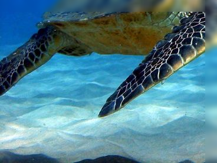

# Image Processing API

API для обработки изображений: разделение на 4 части, применение блюра на стыках и сборка.

## Как запустить

1. Установите зависимости:
npm ci

2. Запустите сервер:
npm run start:dev

Приложение доступно на http://localhost:3000
Опционально можно создать .env файл по примеру .env.example

## Альтернативный запуск (через docker)

1. Билд:
npm run docker:build

2. Запуск контейнера:
npm run docker:deploy

## Документация

- Scalar API: http://localhost:3000/docs
- Swagger UI: http://localhost:3000/swagger

## Пример работы

Исходное изображение:

После обработки получаем 4 части:

 | 
 | 

Финальное изображение:

## Доступные методы

1. POST /image-processing - сохранить в /images 4 части изображения с блюром, вернуть объединенные части с блюром

## Поддерживаемые форматы

JPEG, PNG, WebP

## Настройки

Основные параметры в .env:
PORT=3000
BLUR_STRENGTH=5

## Используемые технологии

- NestJS
- Sharp для обработки изображений
- Scalar API и Swagger для документации
